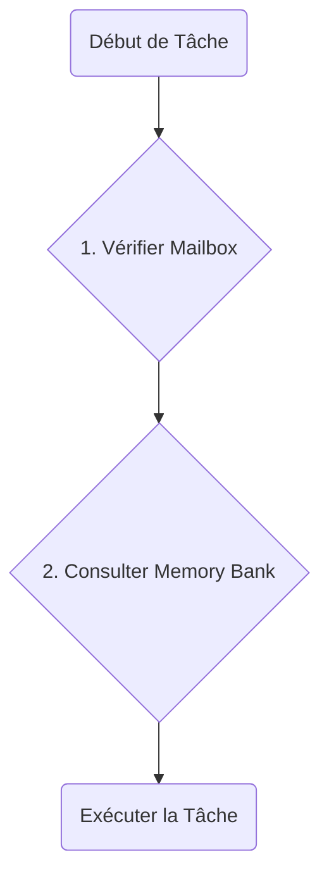
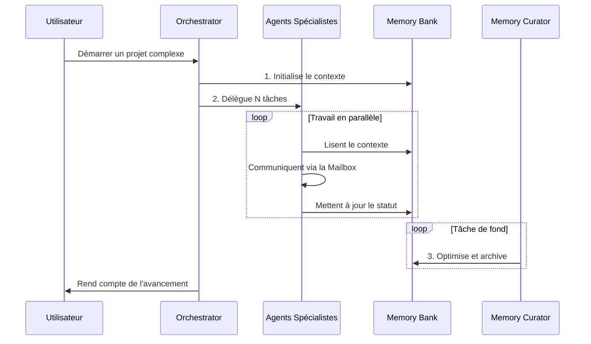

# Framework Agentique "Roo" - Architecture et Fonctionnement

Bienvenue dans la documentation du framework agentique "Roo". Ce document décrit l'architecture, les composants clés et les workflows de ce système conçu pour la collaboration efficace entre agents IA spécialisés.

## 1. Philosophie d'Architecture

Le framework repose sur trois piliers fondamentaux :

1.  **Spécialisation :** Chaque agent possède un domaine d'expertise unique (backend, frontend, architecture, etc.), défini par un ensemble de règles spécifiques. Cela garantit des interventions de haute qualité.
2.  **Mémoire Centralisée et Persistante :** Un "cerveau" commun, le **Memory Bank**, permet de conserver le contexte, les décisions et l'état d'avancement du projet sur le long terme.
3.  **Orchestration Intelligente :** Un agent central, l'Orchestrateur, décompose les tâches complexes et les délègue aux spécialistes appropriés, permettant une exécution parallèle et efficace.

## 2. Composants Clés

### 2.1. Les Agents

Chaque agent est un mode spécialisé avec un rôle, des compétences et des règles qui lui sont propres. Les agents principaux sont :

-   **`🚀 Start & Orchestrate`** : Le point d'entrée. Analyse, décompose et délègue les tâches.
-   **`🏗️ System Architect`** : Prend les décisions d'architecture de haut niveau.
-   **`🛠️ NestJS Developer`** : Spécialiste du développement backend.
-   **`🎨 Nuxt Developer`** : Spécialiste du développement frontend.
-   **`🤖 Convai Integrator`** : Spécialiste de l'intégration d'interfaces vocales.
-   **`🧪 Quality Assurance Tester`** : Assure la qualité via des tests automatisés.
-   **`🧠 Memory Curator`** : Agent de fond pour la maintenance de la mémoire.

### 2.2. Le Memory Bank

Situé dans `/.roo/memory-bank/`, il est le cœur de la mémoire du projet.

-   `productContext.md`: La vision et les objectifs du projet.
-   `activeContext.md`: Les tâches et objectifs de la session en cours.
-   `progress.md`: Le suivi de l'état d'avancement de toutes les tâches.
-   `decisionLog.md`: Un journal immuable des décisions d'architecture (ADR).
-   `systemPatterns.md`: Les standards et modèles de conception à respecter.

### 2.3. Le Système de Règles

Situé dans `/.roo/rules/`, il définit la gouvernance du framework.

-   **Règles Globales :** Standards de code, de performance et de test qui s'appliquent à tous.
-   **Règles Spécifiques :** Instructions détaillées pour chaque agent (ex: `/.roo/rules-nestjs-developer/`).

## 3. Protocoles de Communication

### 3.1. Le Cycle Opérationnel de l'Agent

Chaque agent DOIT suivre ce cycle au début de chaque tâche pour rester synchronisé :

1.  **Vérifier la `Mailbox` :** Consulter les messages directs et prioritaires d'autres agents.
2.  **Consulter le `Memory Bank` :** Charger le contexte global et l'état du projet.

### 3.2. La `Mailbox` (Boîte aux Lettres)

Pour une communication rapide et ciblée, les agents utilisent la `Mailbox` située dans `/.roo/mailbox/`.

-   **Usage :** Un agent crée un fichier (ex: `to-tester.md`) pour envoyer une requête à un autre.
-   **Avantage :** Évite de polluer le `Memory Bank` avec des communications volatiles.

## 4. Workflow pour un Projet Complexe

Voici comment le framework gère un projet avec un grand nombre de tâches :

1.  **Initialisation :** L'**Orchestrateur** reçoit l'objectif, le décompose et initialise le `Memory Bank`.
2.  **Délégation Massive :** L'Orchestrateur crée des dizaines de sous-tâches et les assigne aux agents spécialistes.
3.  **Exécution Parallèle :** Les agents travaillent simultanément. Ils communiquent via la `Mailbox` si nécessaire.
4.  **Maintenance Continue :** Pendant ce temps, le **`Memory Curator`** travaille en arrière-plan pour nettoyer, archiver et optimiser le `Memory Bank`, garantissant que le système reste performant sur la durée.

### Diagramme de Flux

Ce document sert de référence. Pour des détails plus approfondis, veuillez consulter les fichiers de protocole dans le répertoire `/.roo/rules/`.